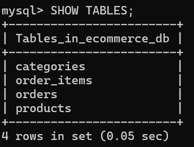

DATABASE CHEMA

| Column Name       | Data Type         | Description                                      |
|-------------------|-------------------|--------------------------------------------------|
| id                | INT               | Unique product ID (Primary Key)                  | 
| name              | VARCHAR(255)      | Product name                                     |
| description       | TEXT              | Product details                                  |
| price             | DECIMAL(10,2)     | Product price                                    |
| category          | VARCHAR(100)      | Product category name                            |
| stock_quantity    | INT               | Available stock                                  |
| image_url         | VARCHAR(255)      | Optional image link                              |
| category_id       | INT               | Optional foreign key linking to categories table |

Method	Endpoint	Description

| Method | Endpoint                  | Description                                      |
|--------|---------------------------|--------------------------------------------------|
| GET    | /api/v1/products        | Retrieve all products from the database            |
| GET    | /api/v1/products/{id}   | Retrieve a single product by its ID                |
| POST   | /api/v1/products        | Create and save a new product to database          |
| PUT    | /api/v1/products/{id}   | Update an existing product details                 |
| DELETE | /api/v1/products/{id}   | Remove a product from the database                 |

1. DATABASE TABLE

//PRODUCTS WITH INITIAL DATA ONLY//

//PRODUCTS AFTER ADDING NEW ITEM//

2. BROWSER CONSOLE

